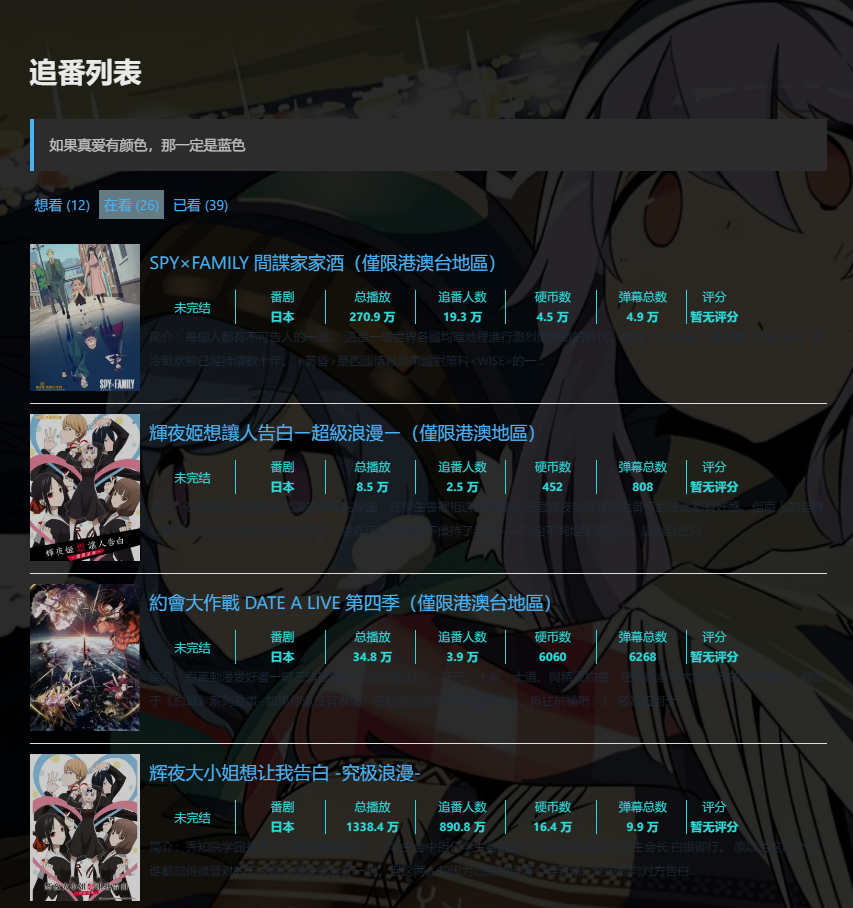

在Hexo架構中用於顯示個人在bilibili的追番內容，參考Github項目[hexo-bilibili-bangumi](https://github.com/HCLonely/hexo-bilibili-bangumi)
<!--truncate-->

### 安裝依賴

```bash
npm install hexo-bilibili-bangumi --save
```

### 配置
將下麵的配置寫入站點的配置文件 `_config.yml` 裏(不是主題的配置文件).

``` yaml
bangumi:
  enable: true
  path:
  vmid:
  title: '追番列錶'
  quote: '生命不息，追番不止！'
  show: 1
  loading:
  metaColor:
  color:
  webp:
  progress:
```

- **enable**: 是否啓用
- **path**: 番劇頁麵路徑，預設`bangumis/index.html`
- **vmid**: 嗶哩嗶哩的 `uid`（登入嗶哩嗶哩後前往[https://space.bilibili.com/](https://space.bilibili.com/)頁麵，網址最後的一串數字就是 `uid`）
- **title**: 該頁麵的標題
- **quote**: 寫在頁麵開頭的一段話，支援 html 文法，可留空。
- **show**: 初始顯示頁麵：`0: 想看`, `1: 在看`, `2: 看過`，預設為`1`
- **loading**: 圖片加載完成前的 loading 圖片
- **metaColor**: meta 部分(簡介上方)字體顔色
- **color**: 簡介字體顔色
- **webp**: 番劇封麵使用`webp`格式(此格式在`safari`瀏覽器下不顯示，但是圖片大小可以縮小 100 倍左右), 預設`true`
- **progress**: 獲取番劇數據時是否顯示進度條，預設`true`

註意：

1. 在`hexo generate`或`hexo deploy`之前使用`hexo bangumi -u`命令更新番劇數據！
2. 刪除數據命令:`hexo bangumi -d`

***需要將追番列錶設定為公開！***
