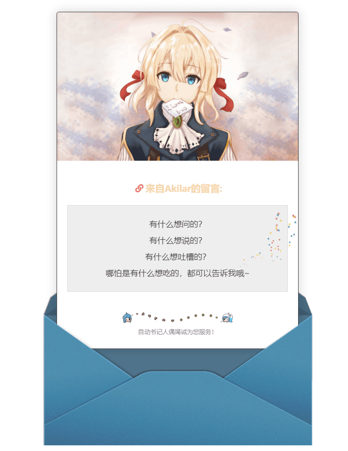

在Hexo架構下的留言闆頁麵
<!--truncate-->


## 安裝模塊

```bash
npm install hexo-butterfly-envelope --save
```

## 修改配置

在站點配置文件或者主題配置文件添加配置項

```yaml
# envelope_comment
# see https://akilar.top/posts/58900a8/
envelope_comment:
  enable: true #開關
  cover: https://ae01.alicdn.com/kf/U5bb04af32be544c4b41206d9a42fcacfd.jpg #信箋封麵圖
  message: #信箋內容，支援多行
    - 有什麼想問的？
    - 有什麼想說的？
    - 有什麼想吐槽的？
    - 哪怕是有什麼想吃的，都可以告訴我哦~
  bottom: 自動書記人偶竭誠為您服務！ #信箋結束語，隻能單行
  height: #調整信箋劃出高度，預設1050px
  path: #【可選】comments 的路徑名稱。預設為 comments，生成的頁麵為 comments/index.html
  front_matter: #【可選】comments頁麵的 front_matter 配置
    title: 留言闆
    comments: true
```
